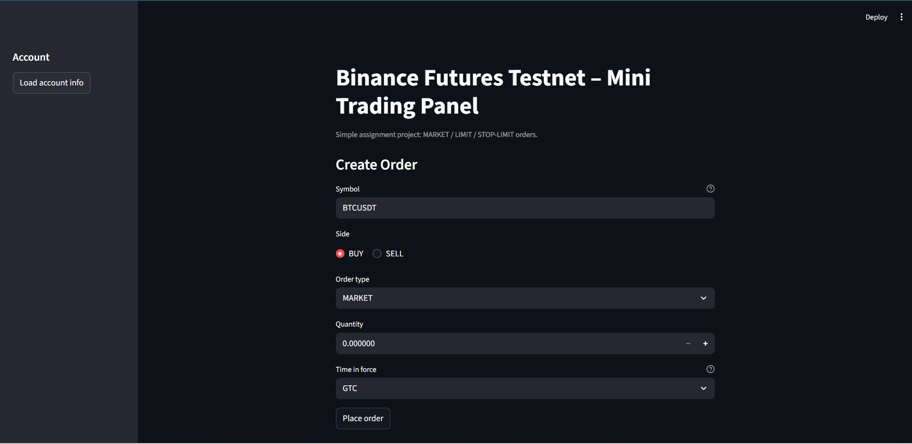
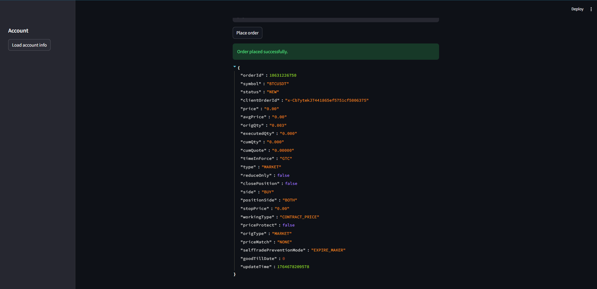
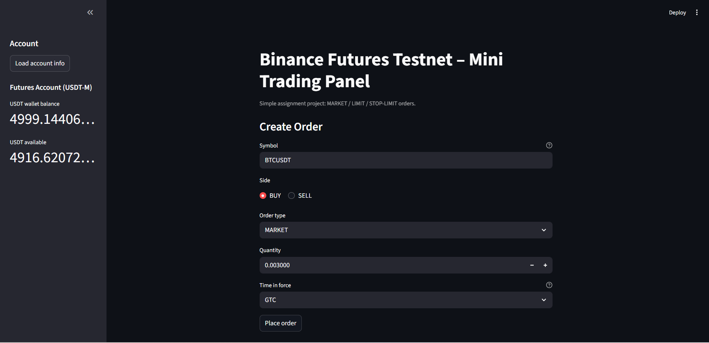

# Binance Futures Testnet Trading Bot

A lightweight trading bot that interacts with the Binance Futures Testnet.
Supports Market, Limit, and Stop-Limit orders via both CLI and a Streamlit web interface.

# Overview

This project demonstrates interaction with exchange APIs, order execution logic, and basic trading automation.
It includes a structured Python backend, logging, validation, and a deployable UI.

# Features

-> Market, Limit, and Stop-Limit order support

-> Binance Futures Testnet integration

-> Account balance and position fetching

-> Pre-check for minimum notional requirements

-> Error and exception handling

-> Rotating log system

-> CLI and Streamlit UI available

-> Environment-based configuration (local + Streamlit secrets)

# Screenshots
User Interface created using Streamlit

Order Placement

Account Information Section

# Architecture Overview

1) trading_bot.py
-> Implements order functions and wraps python-binance.

2) config.py
-> Loads API keys from .env or Streamlit secrets with sanitization.

3) ui.py
-> Streamlit interface for placing orders and viewing account information.

4) cli.py
-> Argparse-based command line tool.

# Possible Enhancements

-> OCO and Trailing Stop orders

-> WebSocket price streaming

-> Grid or TWAP strategies

-> Mock mode for environments blocked by Binance

-> Dashboard for order history and Pn